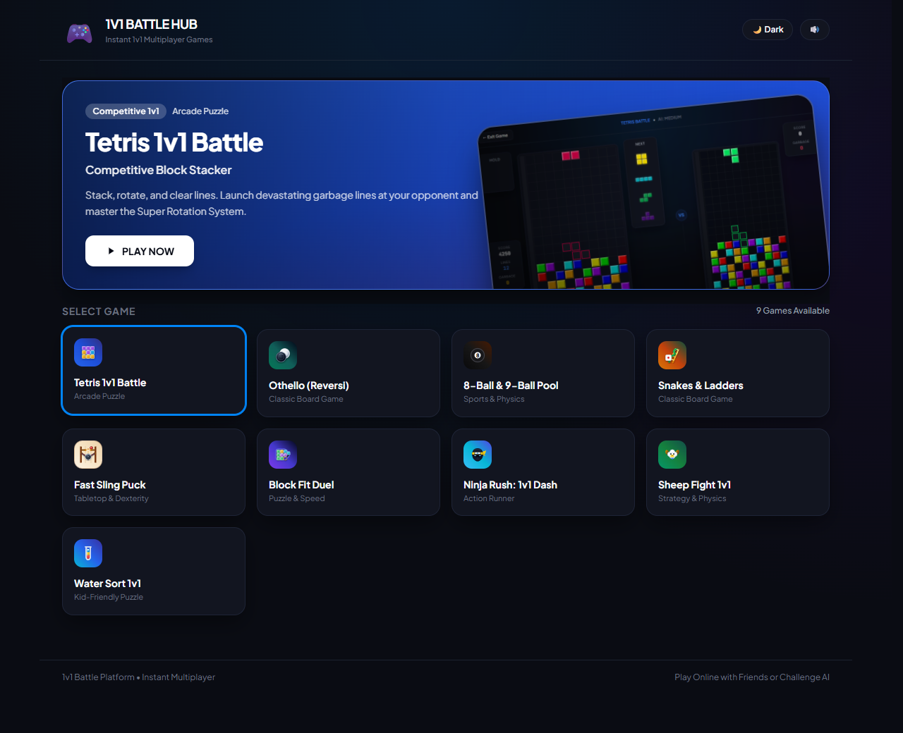

# 🎮 1v1 Arcade Arena (Multiplayer & AI)

A modern, competitive 1v1 web arcade featuring **10 real-time games** built with TypeScript, Vite, Tailwind CSS, HTML5 Canvas, and the Web Audio API. Play head-to-head against friends via direct peer-to-peer **WebRTC** or challenge intelligent **AI bots** with scalable difficulty tiers.



---

## 🕹️ The Games

### 1. Tetris 1v1 Battle
- **Competitive Garbage Mechanics**: Clear lines to attack; 4-line Tetrises, combos, and Back-to-Backs send massive garbage bursts to your opponent.
- **Garbage Cancellation**: Counter incoming garbage in real-time by clearing lines before they rise into your matrix.
- **Guideline Engine**: Authentic Super Rotation System (SRS) with full wall/floor kicks, 7-bag randomizer, hold slot, 4-piece next preview queue, responsive DAS/ARR keyboard timings, and High-DPI Retina canvas rendering.
- **AI Opponents**: 4 difficulty tiers powered by Pierre Dellacherie evaluation heuristics (landing height, eroded cells, transitions, buried holes, and well depth).

### 2. 8-Ball & 9-Ball Pool (Billiards)
- **Physics Engine**: Multi-substep continuous collision detection, realistic cushion restitution, angular momentum, and pocket attraction dynamics.
- **Official Rules**: Opening lag contest to earn break rights, ball-in-hand placement after fouls, legal object ball contact rules, and open table on break.
- **Controls & Aiming**: Interactive cue aiming, drag-to-aim cue stick, fine-tune angle slider, power charge bar, and ghost ball collision guidelines.
- **Single-Player AI**: Geometric raycasting and cushion deflection scoring.

### 3. Othello / Reversi
- **Strategic Depth**: Classic 8x8 disc-flipping board with automatic legal move calculation and pass detection.
- **Animations & Visuals**: Smooth disc-flipping animations, flip combo counts, and turn indicators.
- **Positional AI**: Multi-ply heuristic AI evaluating corner dominance, stable discs, danger X/C squares, and mobility.

### 4. Snakes & Ladders
- **Dynamic 100-Tile Board**: Procedurally generated snake and ladder placements with serpentine grid pathing.
- **Dual Dice Roll**: Authentic Asian-style dice rendering (big red 1, red 4, blue pips) with doubles rolling again rule.
- **Opening Duel**: Roll-off tie-breaker to decide who moves first.
- **Smooth Animation**: Step-by-step token hopping with climb and slide animations.

### 5. Fast Sling Puck
- **High-Speed Tabletop Battle**: Wooden board dexterity duel where both players sling pucks simultaneously with zero turns.
- **Elastic Cord Physics**: Pull pucks backward against flexible tension cords and slingshot them through the narrow center gate.
- **Real-Time Synchronized Duel**: Clear all pucks from your side to win!
- **Predictive AI**: Fast-reacting bot with dynamic shot angle calculation and bounce predictions.

### 6. Block Fit Duel
- **Polyomino Tangram Race**: Race against your opponent to pack colorful geometric shapes into randomized non-rectangular trays with no piece rotation.
- **Best of 5 Duel**: Fast-paced rounds where the first player to successfully pack 3 trays wins the match.
- **Opponent Shadow Tracker**: Real-time ghost silhouette showing your rival's tray fill percentage.
- **Backtracking Solver AI**: Algorithmic puzzle solver that scales from relaxed beginner speeds to lightning-fast master tiers.

### 7. Ninja Rush: 1v1 Dash (Soda Dash)
- **3D Lane Parkour Runner**: Sprint down a sunny 3-lane highway in a high-speed parkour duel.
- **Acrobatic Moves**: Leap over track hurdles and spike barricades, slide under overhead banners, and weave between towering brick walls.
- **Competitive Survival**: Manage 3 hearts, dodge accelerating obstacle waves, collect coins, and outlast your rival.
- **Full Touch & Keyboard**: Responsive swipe and arrow/WASD controls.

### 8. Sheep Fight 1v1
- **5-Lane Tactical Tug-of-War**: Deploy sheep across 5 pasture lanes in a head-to-head clash of mass and momentum.
- **Weight Tiers & Collision Physics**: Choose between speedy runners, balanced sheep, and heavy rams. Colliding sheep lock horns, and net lane weight dictates push direction.
- **Sudden Death Stalemates**: Push through to the opponent's baseline or claim dominance across majority lanes when the clock expires.
- **Dynamic AI**: Lane-countering bot that detects undefended tracks and reinforces active push lanes.

### 9. Water Sort 1v1
- **Tactical Color Bottle Duel**: Pour and sort 10 vibrant liquid colors across test tubes in a fast-paced head-to-head puzzle.
- **Central Reservoir Flask**: Extract 3 matching liquid units into the central flask to bank points and cycle to new color targets.
- **Fluid Visuals & 60 FPS Performance**: GPU-composited liquid pouring animations, oscillating waves, meniscus reflections, and liquid surface glints.
- **Assist HUD & Audio**: Undo move, smart Hint suggestions, Reset option, and tactile liquid splash audio synthesis.
- **Tailored AI Difficulties**: Finely balanced tiers ranging from kid-friendly Easy to lightning-fast Boss mode.

### 10. Tandem Drift Battle 1v1
- **Figure-8 Crossover Track**: Continuous Figure-8 racing ribbon with elevated overpass bridge, red-and-white striped curbs, and 6 high-visibility green drift clipping zones.
- **2-Round Alternating Format**: Battle over two rounds alternating Lead and Chase roles. Cumulative scores determine the victor.
- **Green Zone Multiplier**: Scaled by 4-wheel contact (1 tire = 25%, 2 tires = 50%, 3 tires = 75%, 4 tires = 100% full zone bonus).
- **Commitment & Slip Angle**: Throttle commitment generates thicker rear tire smoke clouds and boosts score; steeper slip angles approaching $90^\circ$ yield rapid score gains.
- **Championship Regulations**: Over-rotation spinouts ($> 95^\circ$) and hard wall stops trigger an instant 0 pts Zero Fault. Chase car cannot overtake Lead's front axle. Stationary $\ge 5.0\text{s}$ triggers an anti-stall DQ countdown.
- **One More Time (OMT) & Sudden Death**: Exact score ties trigger OMT (repeats 2-round battle). Persistent ties advance to a 1-by-1 Sudden Death Solo Drift Sprint where the highest score combined with the lowest elapsed time wins!
- **Authentic OEM Car Models**: Pure OEM factory proportions for the **Toyota Sprinter Trueno AE86** and **Nissan Silvia S15 Spec-R** with tucked wheels that articulate upon counter-steering, rolling tire treads, specular edge contrast, and roof numbers (0–99).

---

## ⚡ Core Features

- **P2P Real-Time Multiplayer**:
  - Direct peer-to-peer connection via **WebRTC DataChannels** (ultra-low latency, zero intermediary game server bandwidth).
  - Shareable **6-letter room codes** (e.g. `XY94TQ`) and direct join links (`?room=XY94TQ`).
  - Automatic NAT traversal via Google STUN servers.
  - Sub-second room handshake with fast 250ms polling and early message queueing.
  - Built-in local mock signaling server in Vite dev mode so you can test two tabs locally out-of-the-box.
  - Synchronized countdowns (`3.. 2.. 1.. GO!`), idle/tabbed-out peer away alerts, and real-time RTT latency HUD.
  - 2-step rematch handshake flow.

- **Intelligent AI Bots**:
  - Custom heuristic, physics, and tree-search AI bots for every game.
  - Configurable difficulty tiers (Easy, Medium, Hard, Boss / Extreme).

- **Zero External Media Dependencies**:
  - **100% Procedural Sound Synthesis**: Built purely with the native Web Audio API (retro 8-bit blips, cue strikes, puck bounces, liquid splashes, sheep bleats, fanfares).
  - Lightweight inline SVG icons and HTML5 Canvas rendering for instant bundle loading.

- **Responsive & Mobile-Ready**:
  - Native mobile touch support: virtual d-pads, touch gestures, swipe controls, and responsive viewport scaling.
  - Dark and light theme modes with instant toggle.

---

## ⌨️ Controls Reference

| Game | Keyboard / Mouse | Touch / Mobile |
| :--- | :--- | :--- |
| **Tetris** | `←` / `→` or `A` / `D`: Move<br>`↓` / `S`: Soft Drop<br>`Space`: Hard Drop<br>`↑` / `W` / `X`: Rotate CW<br>`Z` / `Ctrl`: Rotate CCW<br>`C` / `Shift`: Hold Piece | On-screen virtual D-Pad & action buttons |
| **Pool (Billiards)** | Mouse Drag: Aim cue stick<br>Fine Angle Slider: Degree adjustment<br>Power Meter: Pull & release shot<br>Click Table: Ball-in-Hand reposition | Touch drag cue to aim<br>Touch power slider to strike<br>Tap table to position ball |
| **Othello** | Click highlighted valid square | Tap highlighted valid square |
| **Snakes & Ladders** | Click **Roll Dice** button | Tap **Roll Dice** button |
| **Fast Sling Puck** | Click & drag puck backward against rubber cord; release to shoot | Touch & drag puck backward against rubber cord; release to shoot |
| **Block Fit Duel** | Click & drag pieces into tray silhouette<br>Click placed piece to return to dock | Drag pieces into tray silhouette<br>Tap placed piece to return to dock |
| **Ninja Rush (Soda Dash)** | `A` / `D` or `←` / `→`: Change lane<br>`W` / `↑` / `Space`: Jump<br>`S` / `↓`: Slide | Swipe Left / Right: Change lane<br>Swipe Up: Jump<br>Swipe Down: Slide |
| **Sheep Fight** | Click lane deployment buttons (1–5) | Tap lane deployment buttons (1–5) |
| **Water Sort** | Click source tube, then click destination tube<br>Click reservoir flask to extract target color<br>Undo / Hint / Reset buttons | Tap source tube, then tap target tube<br>Tap reservoir flask to extract target color<br>Undo / Hint / Reset buttons |
| **Tandem Drift Battle** | `W` / `↑`: Throttle<br>`S` / `↓`: Foot Brake<br>`A` / `D` or `←` / `→`: Steer<br>`Space`: Handbrake (Initiate Drift) | On-screen steering controls / pedals |

---

## 🚀 Quick Start (Local Development)

1. **Install dependencies**:
   ```bash
   npm install
   ```

2. **Start the local development server**:
   ```bash
   npm run dev
   ```

3. Open `http://localhost:3000` in your browser.
   - To test multiplayer locally, open two browser windows (or one regular and one incognito tab).
   - In window 1, choose a game, select **1v1 Online**, click **Host New Match**, and copy the room code or link.
   - In window 2, enter the code or paste the URL and click **Join**.
   - Both browsers will connect directly via WebRTC!

---

## 📦 Build & Deployment

### Build for Production
```bash
npm run build
```
This runs TypeScript checking (`tsc`) and bundles optimized static assets into the `dist/` directory via Vite.

### Cloudflare Pages Deployment
- Designed for Cloudflare Pages with Serverless Functions (`functions/api/room/[[path]].ts`).
- Set build command: `npm run build`
- Set build output directory: `dist`
- **Production Edge KV Signaling**:
  Cloudflare Pages Functions execute across globally distributed, ephemeral edge isolates. To ensure players connecting from different regions find each other's room codes, bind a Cloudflare KV namespace named `ROOMS_KV`:
  1. Create the KV namespace:
     ```bash
     npx wrangler kv namespace create ROOMS_KV
     ```
  2. In Cloudflare Dashboard:
     Go to **Workers & Pages** -> your project -> **Settings** -> **Functions** -> **KV namespace bindings** -> Add binding:
     - Variable name: `ROOMS_KV`
     - KV namespace: select the created namespace.
  *(In local Vite development, the built-in single-process signaling mock runs automatically with zero setup).*

---

## 🛠️ Tech Stack & Architecture

- **Language**: TypeScript 5.8
- **Bundler & Tooling**: Vite 6, PostCSS, Tailwind CSS 3.4
- **Rendering**: HTML5 Canvas (High-DPI Retina support), SVG, GPU-accelerated CSS transforms
- **Audio Engine**: Procedural Web Audio API sound synthesis (zero audio files)
- **Networking**: WebRTC DataChannels (P2P), Google STUN, Cloudflare Pages Functions + KV signaling
- **VFX**: Canvas Confetti, particle emitters, dynamic lighting and glassmorphism shaders
